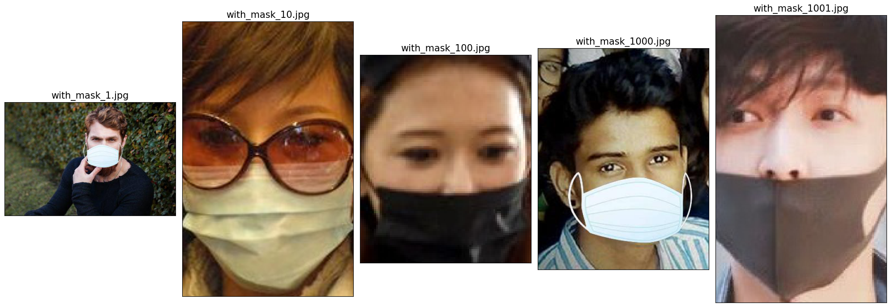
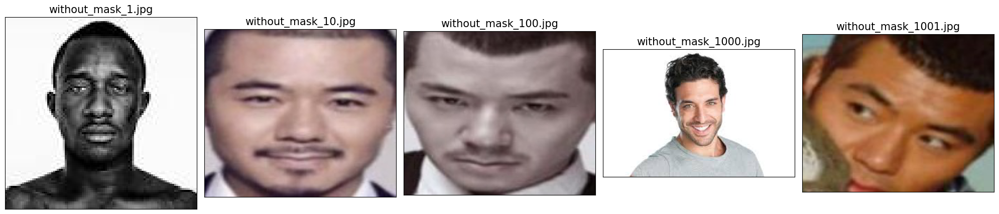
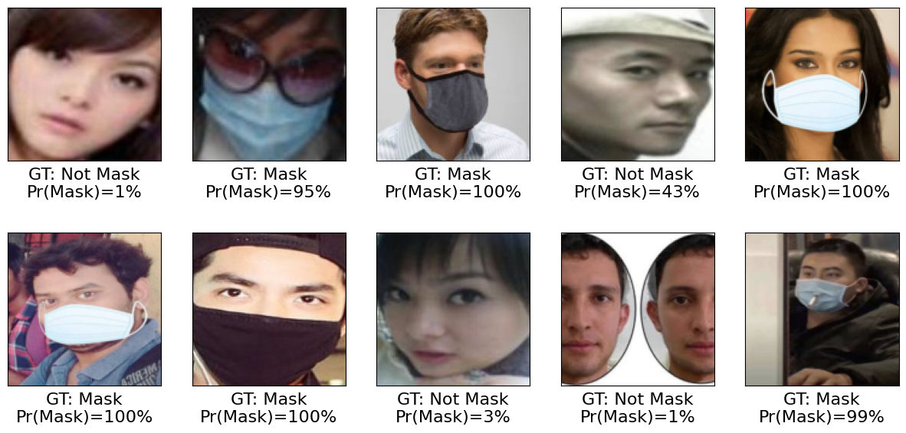

# Face Mask Detection in Python using PyTorch

This repo presents an implementation of Deep Learning approach for Detecting Faces With and Without mask. 

- **Face Mask Detection Dataset**: https://www.kaggle.com/datasets/omkargurav/face-mask-dataset 

Data set consists of 7553 RGB images in 2 folders as with_mask and without_mask. Images are named as label with_mask and without_mask. Images of faces with mask are 3725 and images of faces without mask are 3828.

  

   
   <em> Fig.1 Examples from 'with_mask' class data </em>

  

   
   <em> Fig.2 Examples from 'without_mask' class data  </em>

- ** Results of trained model via CNN on a subset of test dataset ** 

  

   
   <em> Fig.3 Classification Results via CNN </em>

As we can see the trained model achieved successful performance in classifying faces based on the presence or absence of a mask.  

